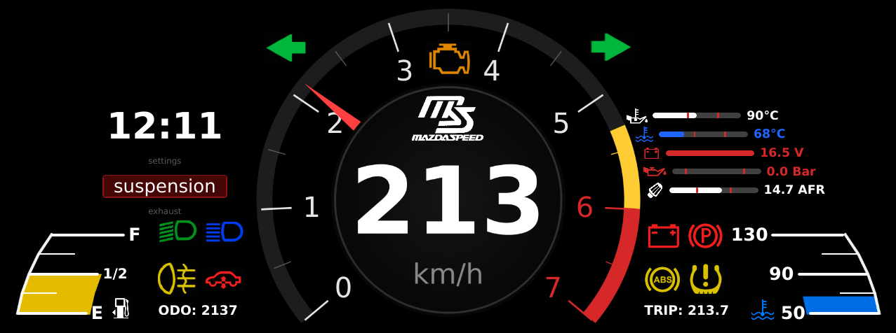

# Virtual Cluster (PySide6/QML)

Virtual automotive cluster (single concentric RPM ring with inner speed, bar‑style fuel & water temperature gauges, status/warning indicators) driven by Teensy 4.1 (EMU Black CAN) or a built‑in DEMO mode fallback.

## Current UI Components
- Central RPM ring (0–7000) with: warning (yellow) band, dynamic oil‑temperature based redline (animated), smooth needle easing.
- Inner circle: large digital speed (km/h) + logo + adaptive background glow (neutral / warn / red) based on RPM state.
- Side bar gauges: FuelGauge (left) & WaterTempGauge (right) – segmented bars with smooth gradient fill and icon blocks. Fuel color transitions low(red) → mid(yellow) → full(white). Water temp transitions cold(blue) → normal(neutral) → hot(red).
- Indicator clusters (left/right) with unified sizing & fade animations: ABS, battery/charging, tire pressure, parking, underglow, low beam, high beam, rear fog, etc.
- Independent left/right turn signal components flanking the main ring (animated green background fade in/out).
- Pulsing CHECK ENGINE indicator with graceful fade‑out.
- Odometer + Trip readouts (trip flashes/pulses on reset action).

## Features
- PySide6 + QML (fullscreen, target 60 FPS)
- Splash screen (logo) with smooth fade; auto dismiss on first telemetry frame or after 1.2 s
- Dynamic redline (table‑driven interpolation vs oil temperature)
- Automatic DEMO fallback when serial device missing
- Custom canvas‑rendered bar gauges (fuel / water) with non‑linear color gradients
- RPM state background transitions (neutral → yellow warn → red)
- Expanded indicator set (turn signals, check engine, underglow, ABS, charging, tire pressure, parking, beams, rear fog)
- Resolution + scale abstraction in `config.py` (authored at 1920×720; default target 1280×480; single uniform scale)

## Requirements
Python 3.11+

## Installation (PC / Linux)
```bash
python -m venv .venv
source .venv/bin/activate
pip install -r requirements.txt
python src/main.py
```
DEMO mode starts automatically if `/dev/ttyACM0` is not present.

## Installation on Raspberry Pi (Raspberry Pi OS Lite 64-bit)
```bash
sudo apt update
sudo apt install -y python3-venv python3-pip libegl1 libgles2 libxcb-xinerama0
cd ~/<repo_directory>
python3 -m venv .venv
source .venv/bin/activate
pip install -r requirements.txt
python src/main.py  # test run
```

### HDMI settings in `/boot/firmware/cmdline.txt` (Pi OS Bookworm)
Append to the existing single line (do NOT create a new line):
```
video=HDMI-A-1:1920x720@60D quiet loglevel=0 vt.global_cursor_default=0
```
For 1280×480:
```
video=HDMI-A-1:1280x480@60D quiet loglevel=0 vt.global_cursor_default=0
```

### Autostart (systemd)
Update the path in `systemd/gauges.service` if the repository is not located at `/home/pi/virtual-cluster`.
```bash
sudo cp systemd/gauges.service /etc/systemd/system/
sudo systemctl daemon-reload
sudo systemctl enable gauges.service
sudo systemctl start gauges.service
```

## Changing Resolution / Scaling
Edit `config.py`:
```python
WIDTH = 1280
HEIGHT = 480
```
Restart the application.

### Logical Design vs Physical Scaling
The UI is authored at 1920×720. A single `content` root is uniformly scaled to the physical size (e.g. 1280×480). Inside QML, reference `content.width` / `content.height` instead of the window to remain resolution‑independent. The exported `SCALE` (e.g. 0.6666 for 1280/1920) is available for pixel‑perfect edge cases.

## Environment Variables
`TEENSY_DEV` – custom serial device path (e.g. `/dev/ttyACM1`).

## Frame format from Teensy
Binary (little-endian) 14 bytes:
```
MAGIC(u16)=0xA55A, VER(u8)=1, LEN(u8)=14, RPM(u16), VSS_cm_s(u16), FLAGS(u16), CRC16-X25(u16)
```
Currently used FLAGS bits (frame may evolve):
```
bit0: Left turn
bit1: Right turn
bit2: High beam
bit3: Park / Brake (was fog earlier)
bit4..11: Fuel (8 bits)
```
Speed: `km/h = (VSS_cm_s / 100.0) * 0.036`.

## Manual Tests
1. DEMO: Disconnect Teensy / missing port → run `python src/main.py` → RPM ring animates, speed updates, fuel & temp bars cycle, indicators blink.
2. Serial: Attach Teensy, ensure `/dev/ttyACM0` exists, restart → log shows `[io_teensy] Opened serial ...` and live data.
3. Alternate port: `export TEENSY_DEV=/dev/ttyACM1 && python src/main.py`.
4. Splash timing: Splash hides <1.2 s if first frame arrives sooner.
5. Dynamic redline: In DEMO observe red band shifting upward as oil temp increases.
6. Fuel / Temp gradients: Observe smooth color transitions as demo cycles.

## TODO
- Backlight (BL_EN / DIM control via Teensy)
- Migrate icons to SVG/Path (hiDPI friendly)
- Real tire pressure input (currently demo pattern)
- User settings persistence (brightness, themes, thresholds)
- Unit tests for frame parsing & redline logic

## License
MIT
